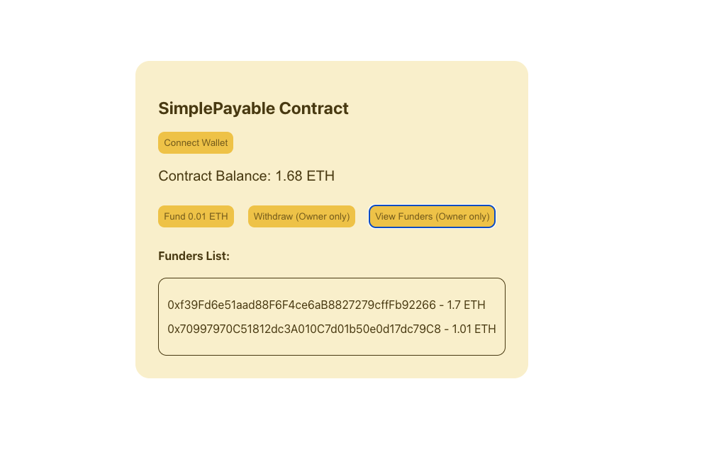

# My DApp

Backend Repo: https://github.com/umashankar-tech/Simple-dapp-defi-fullstack-Application

A decentralized application (dApp) built with React. This project was bootstrapped with [Create React App](https://github.com/facebook/create-react-app).

## Table of Contents
- [Overview](#overview)
- [Getting Started](#getting-started)
- [Available Scripts](#available-scripts)
- [Project Structure](#project-structure)
- [Customization](#customization)
- [Learn More](#learn-more)

## Overview
This project is a starter template for building decentralized applications (dApps) using React. You can use it as a foundation to connect to blockchain networks and interact with smart contracts. In this template, users can fund a smart contract, while the contract owner has the ability to withdraw funds and view a list of addresses that have contributed funding.

## Getting Started

### Prerequisites
- Node.js (v16 or above recommended)
- npm (v8 or above)

### Installation
1. Clone the repository:
   ```bash
   git clone <repository-url>
   cd Simple-Defi-Dapp-Frontend
   ```
2. Install dependencies:
   ```bash
   npm install
   ```

### Running the App
Start the development server:
```bash
npm start
```
Open [http://localhost:3000](http://localhost:3000) to view it in your browser.

## Available Scripts

In the project directory, you can run:

- `npm start` — Runs the app in development mode.
- `npm test` — Launches the test runner in interactive watch mode.
- `npm run build` — Builds the app for production to the `build` folder.
- `npm run eject` — Ejects the app for full configuration control (not reversible).

## Project Structure
```
my-dapp/
├── public/           # Static files
├── src/              # Source code
│   ├── constants/    # App constants
│   ├── App.jsx       # Main app component
│   └── ...           # Other components and files
├── package.json      # Project metadata and scripts
├── README.md         # Project documentation
└── ...
```

## Customization
- Update `src/constants/index.ts` for your app's constants.
- Add your smart contract ABIs and blockchain logic as needed.
- Customize UI components in the `src/` directory.

## Learn More
- [Create React App Documentation](https://facebook.github.io/create-react-app/docs/getting-started)
- [React Documentation](https://reactjs.org/)
- [Web3.js Documentation](https://web3js.readthedocs.io/) 
- [Ethers.js Documentation](https://docs.ethers.io/) 

---


